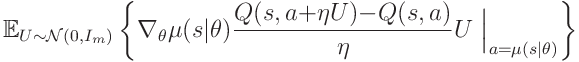
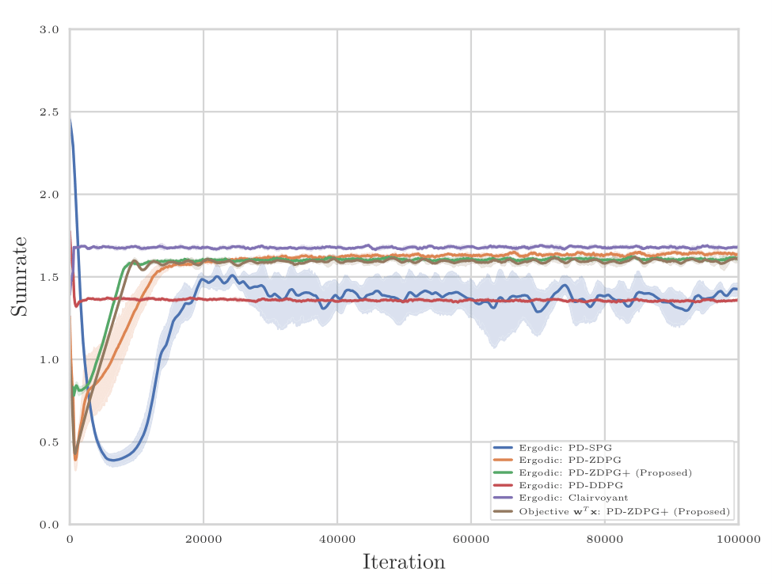

# Critic-Free Deterministic Policy Gradients for One-Step MDPs
Actor-only policy learning with zeroth-order gradient representations of the Critic outperforms (heuristics of) selecting feasible Critic models. We establish this in this work on model-free learning of optimal deterministic resource allocations in wireless systems via action space exploration. Check out the paper for our PD-ZDPG+ algorithm: https://arxiv.org/abs/2108.10352. If you find our algorithm useful, please consider [citing our paper](https://scholar.googleusercontent.com/scholar.bib?q=info:K4q5-28nvkgJ:scholar.google.com/&output=citation&scisdr=CgUBWmp6ENbJsb0ddzA:AAGBfm0AAAAAYyUbbzCfD0h-IM9UyfJGlX8V5qojzp1D&scisig=AAGBfm0AAAAAYyUbbyYiW0_bEOXdmgOr-WkOFXQspdbO&scisf=4&ct=citation&cd=-1&hl=en).

Deterministic Policy Gradient via Action-Space Exploration:
<br />
<p align="left">

</p> 
<br />                                                                                                                 
<p align="center">

</p>  
<br /><br />

Before running the experiments, please clone ```gym-cstr-optim``` from [here](https://github.com/hassaanhashmi/gym-cstr-optim). Afterwards, run the following:

```
pip install -e gym-cstr-optim
sudo apt-get install texlive-latex-recommended 
sudo apt install texlive-latex-extra
sudo apt install dvipng
sudo apt install cm-super
```
<br />
